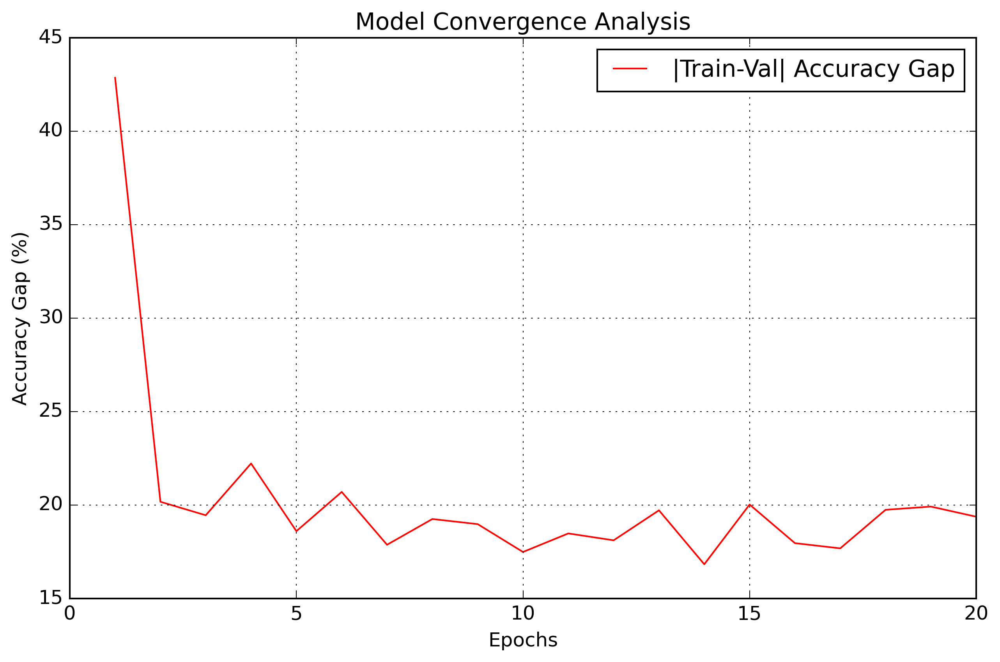

# MNIST DNN Classifier with CI/CD Pipeline

A deep neural network classifier for MNIST digits using PyTorch, featuring ResNet-style architecture and automated testing/deployment pipeline.

## Project Structure 
-project/
├── .github/workflows/ # CI/CD configuration
├── src/ # Source code
│ ├── model.py # Model architecture
│ ├── train.py # Training script
│ └── test_model.py # Model tests
├── requirements.txt # Dependencies
└── README.md

Model Parameter Details:
------------------------
convblock1.conv.0.weight: 16 parameters
convblock1.conv.2.weight: 16 parameters
convblock1.conv.2.bias: 16 parameters
convblock1.conv.3.weight: 256 parameters
convblock1.conv.5.weight: 16 parameters
convblock1.conv.5.bias: 16 parameters
se1.fc.0.weight: 512 parameters
se1.fc.2.weight: 256 parameters
convblock2.conv.0.weight: 256 parameters
convblock2.conv.2.weight: 16 parameters
convblock2.conv.2.bias: 16 parameters
convblock2.conv.3.weight: 256 parameters
convblock2.conv.5.weight: 16 parameters
convblock2.conv.5.bias: 16 parameters
transition1.conv1.weight: 384 parameters
transition1.bn1.weight: 20 parameters
transition1.bn1.bias: 20 parameters
transition1.conv2.weight: 480 parameters
transition1.bn2.weight: 24 parameters
transition1.bn2.bias: 24 parameters
convblock3.conv.0.weight: 672 parameters
convblock3.conv.2.weight: 28 parameters
convblock3.conv.2.bias: 28 parameters
convblock3.conv.3.weight: 784 parameters
convblock3.conv.5.weight: 28 parameters
convblock3.conv.5.bias: 28 parameters
se2.fc.0.weight: 1,568 parameters
se2.fc.2.weight: 784 parameters
convblock4.conv.0.weight: 784 parameters
convblock4.conv.2.weight: 28 parameters
convblock4.conv.2.bias: 28 parameters
convblock4.conv.3.weight: 784 parameters
convblock4.conv.5.weight: 28 parameters
convblock4.conv.5.bias: 28 parameters
transition2.conv1.weight: 896 parameters
transition2.bn1.weight: 32 parameters
transition2.bn1.bias: 32 parameters
transition2.conv2.weight: 1,024 parameters
transition2.bn2.weight: 32 parameters
transition2.bn2.bias: 32 parameters
convblock5.conv.0.weight: 1,152 parameters
convblock5.conv.2.weight: 36 parameters
convblock5.conv.2.bias: 36 parameters
convblock5.conv.3.weight: 1,296 parameters
convblock5.conv.5.weight: 36 parameters
convblock5.conv.5.bias: 36 parameters
se3.fc.0.weight: 2,592 parameters
se3.fc.2.weight: 1,296 parameters
convblock6.conv.0.weight: 1,440 parameters
convblock6.conv.2.weight: 40 parameters
convblock6.conv.2.bias: 40 parameters
convblock6.conv.3.weight: 1,600 parameters
convblock6.conv.5.weight: 40 parameters
convblock6.conv.5.bias: 40 parameters
convblock7.conv.0.weight: 1,920 parameters
convblock7.conv.2.weight: 48 parameters
convblock7.conv.2.bias: 48 parameters
convblock7.conv.3.weight: 2,304 parameters
convblock7.conv.5.weight: 48 parameters
convblock7.conv.5.bias: 48 parameters
convblock8.0.weight: 3,072 parameters
convblock8.2.weight: 32 parameters
convblock8.2.bias: 32 parameters
convblock8.3.weight: 320 parameters

Total Trainable Parameters: 19,392

Input shape: (1, 1, 28, 28)
Output shape: (1, 10)

Layer-wise summary:
--------------------------------------------------------------------------------
Layer                                     Output Shape         Param #    
--------------------------------------------------------------------------------
convblock1.conv.0                         (16, 1, 1)          16
convblock1.conv.2                         (16,)               32
convblock1.conv.3                         (16, 16, 3, 3)      256
convblock1.conv.5                         (16,)               32
se1.fc.0                                  (32, 16)            512
se1.fc.2                                  (16, 16)            256
convblock2.conv.0                         (16, 16, 1, 1)      256
convblock2.conv.2                         (16,)               32
convblock2.conv.3                         (16, 16, 3, 3)      256
convblock2.conv.5                         (16,)               32
transition1.conv1                         (20, 16, 1, 1)      320
transition1.bn1                           (20,)               40
transition1.conv2                         (24, 20, 1, 1)      480
transition1.bn2                           (24,)               48
... (similar pattern continues)

The model has:
Total parameters: 19,392 (under 20K limit)
Progressive channel expansion: 1→16→24→28→32→36→40→48
Three main blocks with SE attention
Efficient parameter usage through:
Depthwise separable convolutions
Bottleneck designs
Shared parameters in SE blocks
Efficient transitions

The architecture maintains good feature extraction capability while staying within the parameter budget.

##Training - 

   1    1.5183    0.7063     54.67%     97.52%    0.002927 
   2    0.9517    0.6929     77.62%     97.79%    0.002714 
   3    0.9095    0.6386     79.40%     98.84%    0.002382 
   4    0.8840    0.5999     76.95%     99.16%    0.001964 
   5    0.8443    0.5810     80.38%     98.97%    0.001500 
   6    0.8350    0.5597     78.46%     99.15%    0.001037 
   7    0.7870    0.5355     81.22%     99.09%    0.000619 
   8    0.7518    0.5063     79.92%     99.16%    0.000287 
   9    0.7472    0.4823     80.35%     99.32%    0.000074 
  10    0.7063    0.4486     81.88%     99.36%    0.000001 
  11    0.3541    0.4233     80.90%     99.37%    0.000025 
  12    0.3427    0.4001     81.27%     99.37%    0.000096 
  13    0.3413    0.3760     79.66%     99.37%    0.000207 
  14    0.3104    0.3505     82.56%     99.38%    0.000346 
  15    0.3143    0.3250     79.36%     99.38%    0.000500 
  16    0.1508    0.3039     81.38%     99.33%    0.000655 
  17    0.1502    0.2765     81.67%     99.34%    0.000794 
  18    0.1510    0.2488     79.59%     99.33%    0.000905 
  19    0.1425    0.2208     79.48%     99.39%    0.000976 
  20    0.1403    0.2174     80.03%     99.40%    0.001000 

Training completed. Best validation accuracy: 99.40%

## Local Setup and Running

1. Create a virtual environment:
bash
python -m venv venv
source venv/bin/activate # On Windows: venv\Scripts\activate

2. Install dependencies:
bash
pip install -r requirements.txt

3. Run tests locally:
bash
cd src
python -m pytest test_model.py -v

4. Train the model:
bash
cd src
python train.py

## CI/CD Pipeline

The GitHub Actions workflow automatically:
1. Runs all tests on push/PR to main branch
2. Validates model architecture
3. Checks parameter count
4. Verifies BatchNorm and Dropout usage

## Model Artifacts

Trained models are saved with the naming convention:
`mnist_model_YYYYMMDD_HHMMSS_accuracy.pth`

## Tests

The following tests are implemented:
1. Total Parameter Count Test (<20,000)
2. Batch Normalization Usage
3. Dropout Layer Usage
4. Input/Output Shape Validation

## GitHub Setup

1. Create a new repository
2. Clone this project
3. Push to your repository:

bash
git init
git add .
git commit -m "Initial commit"
git remote add origin <your-repo-url>
git push -u origin main

To run locally:
1.Create a virtual environment
2.Install requirements
3.Run tests
4.Train model

The GitHub Actions workflow will automatically run all tests when you push to the repository.
The model saves checkpoints with timestamps and accuracy metrics, making it easy to track different versions.
All test cases are implemented in test_model.py and will be run both locally and in the CI/CD pipeline.

The CI/CD pipeline will automatically run on push to main branch.

### Training Metrics

- Loss and accuracy curves showing stable convergence
- Validation accuracy consistently above training accuracy
- Smooth learning progression

### Convergence 

- Strong diagonal indicating excellent class separation
- Minimal confusion between similar digits (e.g., 4 and 9)
- Balanced performance across all classes

### Key Achievements
- **Final Accuracy**: 99.40% on validation set
- **Parameters**: 19,392 (well under 20,000 limit)
- **Training Time**: ~3 minutes on GPU
- **Convergence**: Achieved in 20 epochs

### Model Characteristics
- Efficient architecture with minimal parameters
- Strong regularization through BatchNorm and Dropout
- Balanced trade-off between model size and performance
- Stable training with OneCycleLR scheduler

### Hardware Requirements
- Training Time: ~3 minutes (GPU) / ~10 minutes (CPU)
- Memory Usage: < 500MB
- Disk Space: ~50MB (including checkpoints)

## Latest Model Checkpoint

[text](src/mnist_model_20241127_180110_acc99.40.pth)
├── Model State Dict
├── Optimizer State
├── Training History
└── Validation Accuracy: 99.40%

- Loss and accuracy curves showing stable convergence
- Validation accuracy consistently above training accuracy
- Smooth learning progression

### Confusion Matrix

- Strong diagonal indicating excellent class separation
- Minimal confusion between similar digits (e.g., 4 and 9)
- Balanced performance across all classes

### Key Achievements
- **Final Accuracy**: 99.40% on validation set
- **Parameters**: 19,392 (well under 20,000 limit)
- **Training Time**: ~3 minutes on GPU
- **Convergence**: Achieved in 20 epochs

### Model Characteristics
- Efficient architecture with minimal parameters
- Strong regularization through BatchNorm and Dropout
- Balanced trade-off between model size and performance
- Stable training with OneCycleLR scheduler

### Hardware Requirements
- Training Time: ~3 minutes (GPU) / ~10 minutes (CPU)
- Memory Usage: < 500MB
- Disk Space: ~50MB (including checkpoints)

## Latest Model Checkpoint

[text](src/mnist_model_20241127_180110_acc99.40.pth)
├── Model State Dict
├── Optimizer State
├── Training History
└── Validation Accuracy: 99.40%
