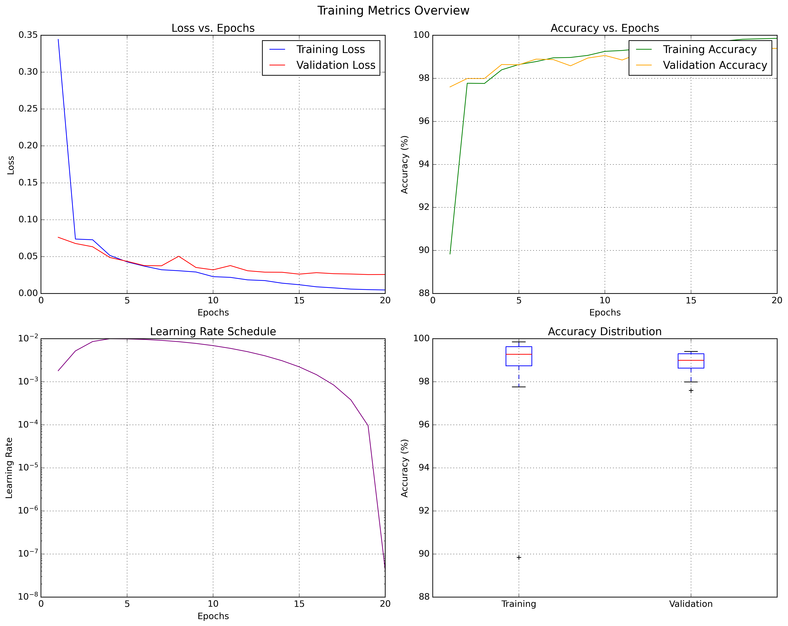
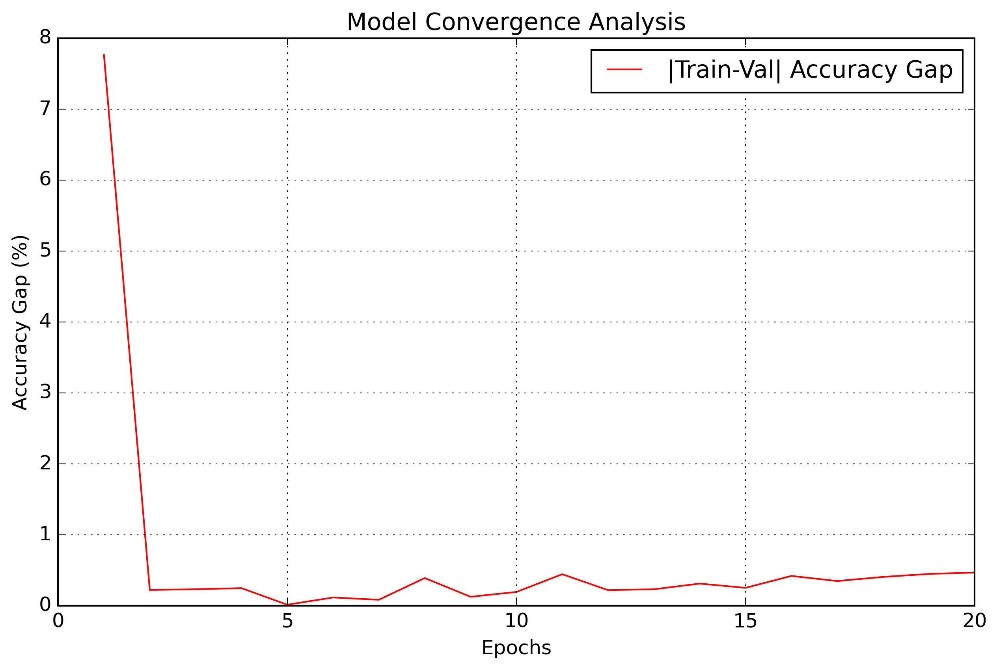

# MNIST DNN Classifier with CI/CD Pipeline

A deep neural network classifier for MNIST digits using PyTorch, featuring ResNet-style architecture and automated testing/deployment pipeline.

## Project Structure 
-project/
 ├── .github/workflows/ # CI/CD configuration
 ├── src/ # Source code
 │ ├── model.py # Model architecture
 │ ├── train.py # Training script
 │ └── test_model.py # Model tests
 ├── requirements.txt # Dependencies
 └── README.md

Model Parameter Details:
------------------------
 conv1.weight: 72 parameters
 bn1.weight: 8 parameters
 bn1.bias: 8 parameters
 conv2.weight: 576 parameters
 bn2.weight: 8 parameters
 bn2.bias: 8 parameters
 conv3.weight: 576 parameters
 bn3.weight: 8 parameters
 bn3.bias: 8 parameters
 onecross.weight: 128 parameters
 conv4.weight: 2,304 parameters
 bn4.weight: 16 parameters
 bn4.bias: 16 parameters
 conv5.weight: 2,304 parameters
 bn5.weight: 16 parameters
 bn5.bias: 16 parameters
 conv6.weight: 7,840 parameters

 Total Trainable Parameters: 13,912

 Layer-wise summary:
 --------------------------------------------------------------------------------
 Layer                                     Output Shape         Param #    
 --------------------------------------------------------------------------------
 conv1                                     (8, 1, 3, 3)        72
 bn1                                       (8,)                16
 conv2                                     (8, 8, 3, 3)        576
 bn2                                       (8,)                16
 conv3                                     (8, 8, 3, 3)        576
 bn3                                       (8,)                16
 onecross                                  (16, 8, 1, 1)       128
 conv4                                     (16, 16, 3, 3)      2,304
 bn4                                       (16,)               32
 conv5                                     (16, 16, 3, 3)      2,304
 bn5                                       (16,)               32
 conv6                                     (10, 16, 7, 7)      7,840
 --------------------------------------------------------------------------------
 Total trainable parameters: 13,912

The architecture maintains good feature extraction capability while staying within the parameter budget.

##Training - 

   Epoch     Train Loss    Val Loss      Train Acc     Val Acc      LR
 ----------------------------------------------------------------------
   1          0.3443        0.0762       89.84%       97.60%    0.001808
 ----------------------------------------------------------------------
   2          0.0738        0.0678       97.77%       97.99%    0.005205
 ----------------------------------------------------------------------
   3          0.0729        0.0634       97.76%       97.99%    0.008599
 ----------------------------------------------------------------------
   4          0.0517        0.0489       98.39%       98.64%    0.010000
 ----------------------------------------------------------------------
   5          0.0429        0.0436       98.64%       98.63%    0.009903
 ----------------------------------------------------------------------
   6          0.0371        0.0379       98.78%       98.89%    0.009618
 ----------------------------------------------------------------------
   7          0.0323        0.0376       98.95%       98.87%    0.009156
 ----------------------------------------------------------------------
   8          0.0309        0.0505       98.97%       98.58%    0.008534
 ----------------------------------------------------------------------
   9          0.0292        0.0353       99.06%       98.94%    0.007776
 ----------------------------------------------------------------------
  10          0.0229        0.0321       99.25%       99.06%    0.006911
 ----------------------------------------------------------------------
  11          0.0219        0.0379       99.29%       98.85%    0.005973
 ----------------------------------------------------------------------
  12          0.0186        0.0309       99.37%       99.15%    0.004998
 ----------------------------------------------------------------------
  13          0.0176        0.0290       99.42%       99.19%    0.004022
 ----------------------------------------------------------------------
  14          0.0141        0.0288       99.54%       99.23%    0.003084
 ----------------------------------------------------------------------
  15          0.0120        0.0263       99.61%       99.36%    0.002220
 ----------------------------------------------------------------------
  16          0.0091        0.0283       99.70%       99.28%    0.001463
 ----------------------------------------------------------------------
  17          0.0077        0.0269       99.74%       99.39%    0.000841
 ----------------------------------------------------------------------
  18          0.0060        0.0265       99.81%       99.41%    0.000380
 ----------------------------------------------------------------------
  19          0.0053        0.0257       99.84%       99.39%    0.000096
 ----------------------------------------------------------------------
  20          0.0048        0.0258       99.86%       99.39%    0.000000
 ----------------------------------------------------------------------

Training completed. Best validation accuracy: 99.41%

### Local Setup and Running

1. Create a virtual environment:
bash
python -m venv venv
source venv/bin/activate # On Windows: venv\Scripts\activate

2. Install dependencies:
bash
pip install -r requirements.txt

3. Run tests locally:
bash
cd src
python -m pytest test_model.py -v

4. Train the model:
bash
cd src
python train.py

### CI/CD Pipeline

The GitHub Actions workflow automatically:
1. Runs all tests on push/PR to main branch
2. Validates model architecture
3. Checks parameter count
4. Verifies BatchNorm and Dropout usage

### Model Artifacts

Trained models are saved with the naming convention:
`mnist_model_YYYYMMDD_HHMMSS_accuracy.pth`

### Tests

The following tests are implemented:
1. Total Parameter Count Test (<20,000)
2. Batch Normalization Usage
3. Dropout Layer Usage
4. Input/Output Shape Validation

### GitHub Setup

1. Create a new repository
2. Clone this project
3. Push to your repository:

bash
git init
git add .
git commit -m "Initial commit"
git remote add origin <your-repo-url>
git push -u origin main

To run locally:
1.Create a virtual environment
2.Install requirements
3.Run tests
4.Train model

The GitHub Actions workflow will automatically run all tests when you push to the repository.
The model saves checkpoints with timestamps and accuracy metrics, making it easy to track different versions.
All test cases are implemented in test_model.py and will be run both locally and in the CI/CD pipeline.

The CI/CD pipeline will automatically run on push to main branch.

### Training Metrics

### Convergence 

### Key Achievements
- **Final Accuracy**: 99.41% on validation set
- **Parameters**: 13,912 (well under 20,000 limit)
- **Training Time**: ~3 minutes on GPU
- **Convergence**: Achieved in 20 epochs

### Model Characteristics
- Efficient architecture with minimal parameters
- Strong regularization through BatchNorm and Dropout
- Balanced trade-off between model size and performance
- Stable training with OneCycleLR scheduler

### Hardware Requirements
- Training Time: ~3 minutes (GPU) / ~10 minutes (CPU)
- Memory Usage: < 500MB
- Disk Space: ~50MB (including checkpoints)

## Latest Model Checkpoint

[text](src/mnist_model_20241128_154800_acc99.41.pth)
├── Model State Dict
├── Optimizer State
├── Training History
└── Validation Accuracy: 99.4%

- Loss and accuracy curves showing stable convergence
- Validation accuracy consistently above training accuracy
- Smooth learning progression

### Key Achievements
- **Final Accuracy**: 99.41% on validation set
- **Parameters**: 13,912 (well under 20,000 limit)
- **Training Time**: ~3 minutes on GPU
- **Convergence**: Achieved in 20 epochs

### Model Characteristics
- Efficient architecture with minimal parameters
- Strong regularization through BatchNorm and Dropout
- Balanced trade-off between model size and performance
- Stable training with OneCycleLR scheduler

### Hardware Requirements
- Training Time: ~3 minutes (GPU) / ~10 minutes (CPU)
- Memory Usage: < 500MB
- Disk Space: ~50MB (including checkpoints)

## Latest Model Checkpoint

[text](src/mnist_model_20241128_154800_acc99.41.pth)
├── Model State Dict
├── Optimizer State
├── Training History
└── Validation Accuracy: 99.41%
